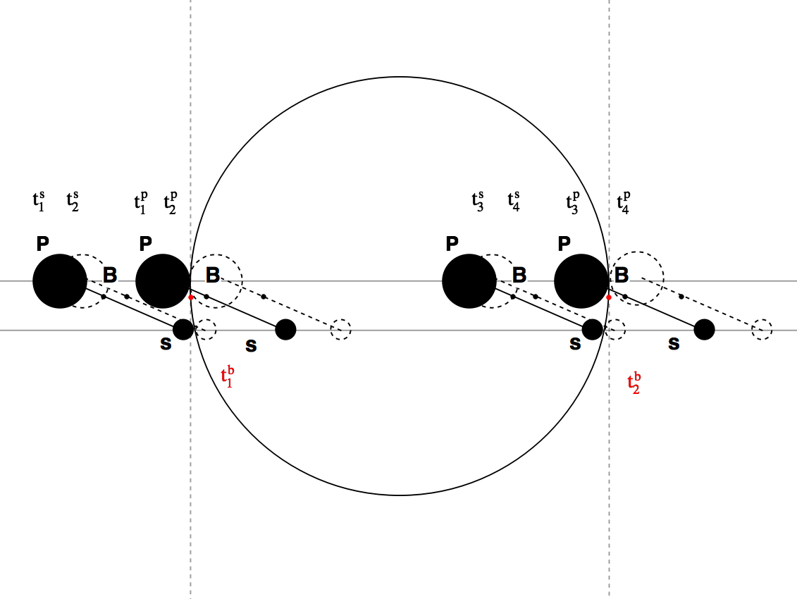

# SputnikMoments
In this repository you can find numerical simulation of transits of planet with satellites system.
The repository initially describe numerical culculations behind the article on exomoons detection https://arxiv.org/abs/1704.00202. 

 
